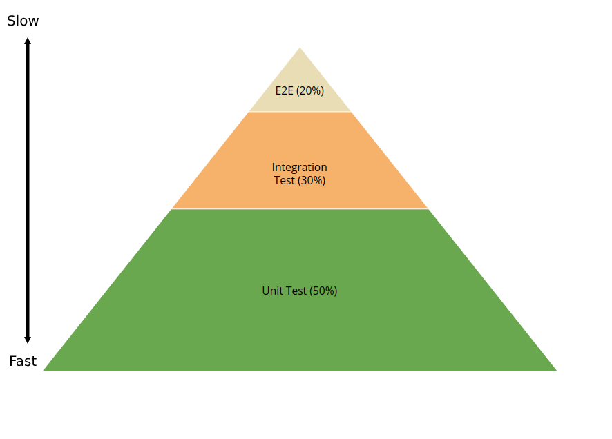

# 🔺 The Testing Pyramid

The **Testing Pyramid** is a conceptual framework that helps developers understand the different types of tests they should write and how to balance them. It emphasizes the importance of having a solid foundation of unit tests, supported by integration tests, and a smaller number of end-to-end (E2E) tests. The pyramid shape illustrates the proportion of each type of test you should aim for in your test suite, usually it is **50% unit tests, 30% integration tests,** and **20% end-to-end (E2E) tests**

## 📑 **The Layers of the Testing Pyramid**

1. **Unit Tests (Base of the Pyramid)**

   - **What**: Tests individual components or units of code in isolation.
   - **Why**: They are fast, reliable, and help catch bugs early in the development process.
   - **How Many**: You should have the most unit tests because they are cheap to write and maintain.

2. **Integration Tests (Middle Layer)**

   - **What**: Tests how multiple units or components work together.
   - **Why**: Ensures that different parts of the system interact correctly.
   - **How Many**: Fewer than unit tests but more than E2E tests.

3. **End-to-End (E2E) Tests (Top of the Pyramid)**

   - **What**: Tests the entire application workflow from start to finish, simulating real user scenarios.
   - **Why**: Ensures the system works as a whole and meets user expectations.
   - **How Many**: The fewest in number because they are slow, expensive to write, and harder to maintain.
   - **Example**: Testing the workflow of adding a superhero to a team via an API.

## 💭 **Why the Testing Pyramid Works**

1. **Speed**: Unit tests are fast and can be run frequently during development.
2. **Reliability**: Unit tests are less flaky because they test small, isolated pieces of code.
3. **Cost**: Unit tests are cheaper to write and maintain compared to integration and E2E tests.
4. **Coverage**: Unit tests provide broad coverage of the codebase, while integration and E2E tests ensure the system works as a whole.

---

The higher up you go in the pyramid, the more brittle and less predictable your tests are. What's more, e2e tests are by far the slowest to run so even though they can bring confidence that your application is doing what's expected of it, you shouldn't have nearly as many of them as unit or integration tests.
